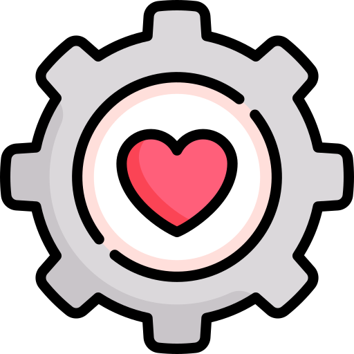

  

<!-- <h1 align="center">Mon coffre à outils de dev</h1> -->

 
  Pour plus de productivité, de créativité et un code plus propre — mise à jour régulièrement ✨

  <a href="#-ui--design">🎨 UI & Design</a> •
  <a href="#-frameworks--librairies">⚙️ Frameworks</a> •
  <a href="#-apprentissage--références">📚 Apprentissage</a> •
  <a href="#-outils--productivité">🚀 Outils</a> •
  <a href="#-déploiement--plateformes">☁️ Déploiement</a>

---

### 🧩 **Composants UI prêts à l’emploi**

| Nom | Description | Lien |
|-----|-------------|------|
| shadcn-ui             | Composants UI modernes, accessibles et stylés. Basé sur Radix UI + Tailwind CSS. | [🔗](https://ui.shadcn.com) |
| aceternity-ui | Composants React populaires (style shadcn) sans configuration nécessaire. | [🔗](https://ui.aceternity.com) |
| magicui | Composants animés et interactifs (shadcn + framer-motion). Interfaces dynamiques. | [🔗](https://magicui.design) |
| Berlix | UI élégante et puissante, interactions fluides, esthétique raffinée. | [🔗](https://berlix.vercel.app/) |
| origin-ui | Composants accessibles avec animations, thèmes light/dark et bonne doc. | [🔗](https://originui.com/) |
| cult-ui | Design original, sombre et élégant. Look "edgy" prêt à l'emploi. | [🔗](https://www.cult-ui.com/) |
| Extend UI | Composants shadcn pré-construits, extensibles et copiables via une UI. | [🔗](https://www.extend-ui.com/) |